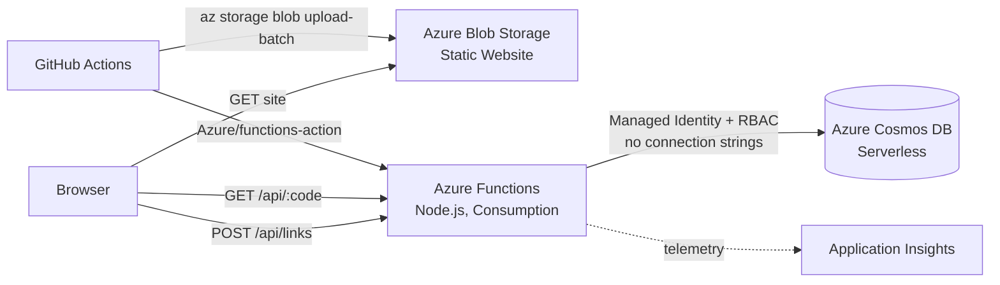

# Snip

A serverless URL shortener built on Azure, created as a hands-on learning project to practice core Azure services end-to-end: static hosting, serverless compute, a managed NoSQL database, identity-based security, CI/CD, and infrastructure as code.

**Live site:** https://snipiacstore3939.z23.web.core.windows.net/

## Architecture



## How it works

A static frontend (plain HTML/JS, styled with Tailwind + daisyUI via CDN) is hosted directly from an Azure Storage account's static website feature — no web server involved. It calls two HTTP-triggered Azure Functions:

- `POST /api/links` - accepts a long URL, generates a random 6-character short code, writes a document to Cosmos DB.
- `GET /api/{shortCode}` - looks up the code in Cosmos DB and issues a 302 redirect to the original URL.

The Function App authenticates to Cosmos DB using its system-assigned managed identity and a Cosmos DB RBAC role assignment (Data Contributor) — there is no connection string or key stored anywhere. Cosmos DB's `disableLocalAuth` is set to `true`, so key-based access is impossible even if someone found the account.

## Infrastructure as code

Everything above is defined in [`infra/`](./infra) as Bicep, with no manually-clicked resources. The template is split into modules:

| File | Provisions |
|---|---|
| `main.bicep` | Orchestrates the modules below, wires their outputs together |
| `modules/storage.bicep` | Storage account + static website (enabled via a deploymentScript, since it's a data-plane setting ARM can't configure directly) |
| `modules/functionapp.bicep` | Function App, its Consumption hosting plan, its own internal storage account, and Application Insights |
| `modules/cosmos.bicep` | Cosmos DB account (serverless), database, and container |
| `modules/cosmos-rbac.bicep` | Grants the Function App's managed identity Cosmos DB Data Contributor access - split into its own module to avoid a circular dependency between the Function App and Cosmos DB modules |

### Deploy it yourself

```bash
az group create --name <your-rg-name> --location <your-region>
az deployment group create \
  --resource-group <your-rg-name> \
  --template-file infra/main.bicep \
  --parameters baseName=<short-name, 8 chars or fewer>
```

This provisions the infrastructure only — deploying the actual site content and function code is a separate step, handled by the CI/CD pipeline below.

### Tear it down

```bash
az group delete --name <your-rg-name>
```

One command removes every resource this project created. This was verified in practice: the entire stack was destroyed and rebuilt from this Bicep template with zero manual Portal steps.

## CI/CD

`.github/workflows/deploy.yml` runs on every push to `main`:

- **deploy-frontend** uploads `frontend/` to the storage account's `$web` container using a scoped SAS token.
- **deploy-api** publishes `api/` to the Function App using a publish profile.

## Deliberate scope decisions

A few things a fully production-grade setup would include were intentionally left out of this project, to keep the learning scope focused:

- **Custom domain / HTTPS certificate, CDN (Front Door)** - not configured; Azure's default endpoints are used as-is.
- **OIDC/federated-credential auth for GitHub Actions** - the pipeline uses a SAS token and a publish profile rather than passwordless workload identity federation.
- **Free-tier Cosmos DB** - this deployment uses serverless capacity mode instead, since the free tier is one-per-Azure-subscription and was already claimed by an earlier iteration of this project.

These were deliberate trade-offs to keep this project's scope manageable, not oversights - each one is planned for a follow-up project with a more production-oriented scope.

## Stack

Azure Blob Storage (static website) - Azure Functions (Node.js, Consumption plan) - Azure Cosmos DB (Core SQL API, serverless) - Application Insights - Bicep - GitHub Actions
